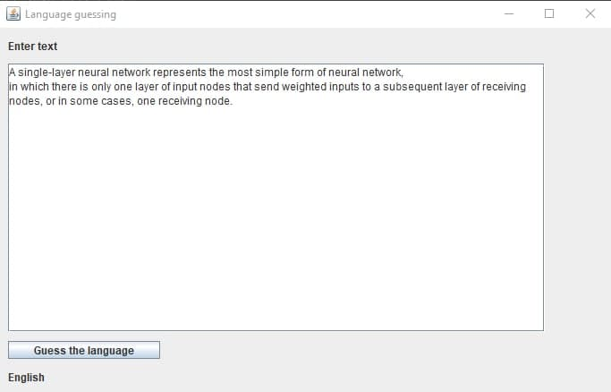
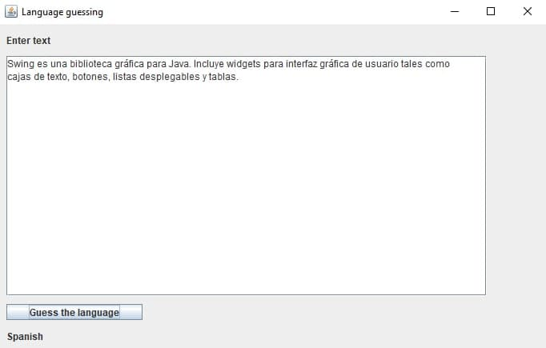

# Language recognition

### Single-layer neural network recognizing languages ​​written in the Latin alphabet

Input:
* at least 10 files with text for each recognised language

Neural network recognizes language based on the proportion of letters in the text. It is trained with Delta rule.

GUI was made using Java Swing library.

